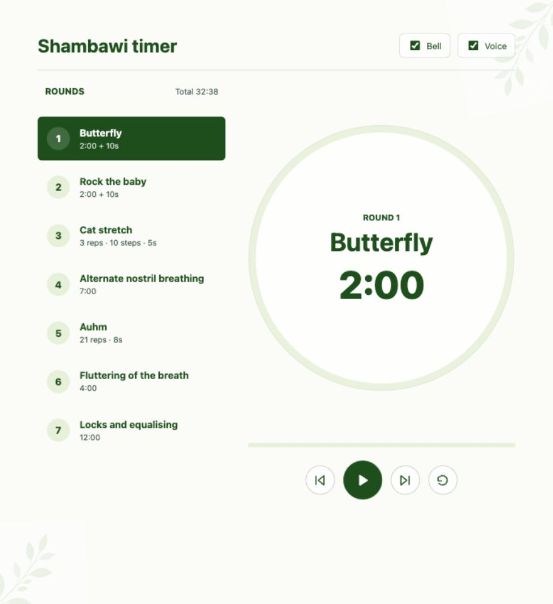

# Shambawi Timer

A browser-based meditation timer for a structured seven-round Shambawi practice. It combines timed exercises, counted repetitions, transition bells, and spoken announcements in a responsive interface.



## Practice

| Round | Exercise | Structure |
| --- | --- | --- |
| 1 | Butterfly | 2 minutes, then a 10-second transition |
| 2 | Rock the baby | 2 minutes, then a 10-second transition |
| 3 | Cat stretch | 3 repetitions of 10 steps, 5 seconds per step |
| 4 | Alternate nostril breathing | 7 minutes |
| 5 | Auhm | 21 repetitions, 8 seconds each |
| 6 | Fluttering of the breath | 4 minutes |
| 7 | Locks and equalising | 12 minutes |

## Features

- Bell and spoken exercise announcements between rounds
- Repetition and step counting for structured exercises
- Previous, next, pause, resume, and reset controls
- Independent Bell and Voice toggles
- Responsive desktop layout and a single-screen mobile layout
- Keyboard-visible focus states and reduced-motion support

## Run locally

Requires Node.js. The project has no third-party runtime dependencies.

```sh
npm run dev
```

Open [http://localhost:4173](http://localhost:4173).

To use another port:

```sh
PORT=8080 npm run dev
```

## Test

```sh
npm test
```
