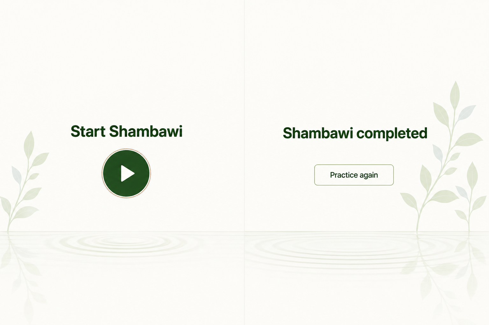
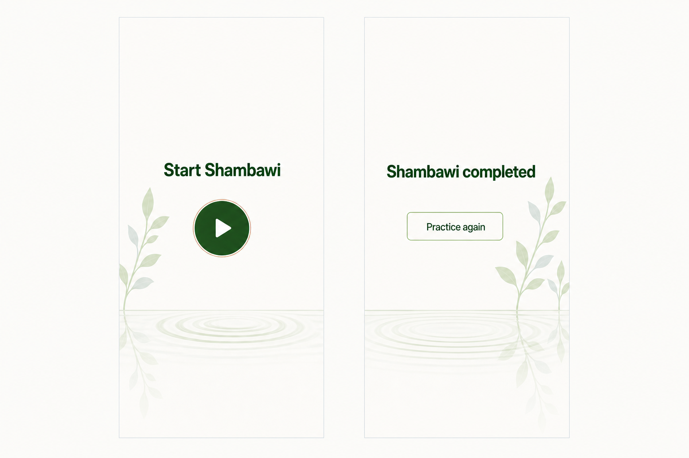

# Shambawi Welcome and Completion States Design

**Status:** Approved in visual exploration on 2026-07-20
**Selected direction:** Still Water

## Summary

Add explicit welcome and completed phases around the existing meditation timer. The welcome phase presents only `Start Shambawi` and a circular play action. The completed phase presents only `Shambawi completed` and a quiet `Practice again` action.

Both phases use the approved Still Water art direction: pale botanical stems at the outer edge, a low waterline, and subtle ripples on the existing near-white surface. The timer's rounds, timing, controls, bell, voice cues, and responsive practice layout remain unchanged while the practice phase is active.

## Approved References

### Desktop

### Mobile

The images establish composition and mood. Production UI text, control geometry, focus states, and responsive dimensions must be implemented in HTML and CSS rather than embedded in a screenshot.

## Goals

- Give the practice a deliberate beginning before round 1 appears.
- Give completion a calm resting state instead of leaving the final round visible.
- Keep each new phase focused on one action.
- Preserve the existing timer schedule, cue timing, round navigation, sound settings, and practice layout.
- Fit each phase within one viewport without scrolling, including a `390 x 844` mobile viewport.

## Non-goals

- No changes to practice-plan data, round durations, repetition counting, transitions, or total duration.
- No onboarding, instructions, progress summary, statistics, or round preview on the welcome or completed phase.
- No new sound settings or persistence mechanism.
- No looping ambient animation, music, confetti, religious symbols, or additional copy.
- No redesign of the active timer screen.

## Session Phases

The application has three explicit phases:

1. `welcome`: the initial state after page load and the destination of Reset.
2. `practice`: the existing timer interface and timing behavior.
3. `completed`: the state entered when elapsed time reaches the total practice duration.

`state.phase` is the source of truth. Rendering must not infer completion from a missing timeline segment because `getSegmentAt()` currently returns the final segment at the end of the timeline.

### Valid transitions

| Current phase | Event | Next phase | Result |
| --- | --- | --- | --- |
| `welcome` | Start | `practice` | Reset timing state, unlock audio, begin round 1, and run the existing first-segment cue behavior. |
| `practice` | Practice reaches total duration | `completed` | Stop animation frames, play the existing completion bell and voice cue, and show the completed phase. |
| `practice` | Reset | `welcome` | Stop timing, cancel pending speech/cues, reset elapsed time and segment bookkeeping, and show the welcome phase. |
| `completed` | Practice again | `practice` | Cancel the pending completion cue or speech, reset timing state, and immediately begin round 1 from the user gesture. |

Repeated or stale events that do not match the current phase have no effect. This prevents double-clicks from starting concurrent animation loops.

## Welcome Phase

- Full-viewport, unframed surface using `#fbfcf8`.
- Centred heading: `Start Shambawi`.
- One circular forest-green button with a familiar play icon and accessible name `Start Shambawi`.
- No application title bar, round list, timer, progress, Bell toggle, Voice toggle, or supporting text is visible or keyboard-focusable.
- Activating the button enters `practice` and starts immediately. It is not an intermediate continue step.

## Completed Phase

- Full-viewport, unframed surface using `#fbfcf8`.
- Centred heading: `Shambawi completed`.
- One visually quiet bordered button labelled `Practice again`.
- No round list, final timer value, progress, settings, statistics, or supporting text is visible or keyboard-focusable.
- Activating `Practice again` resets and starts a new practice immediately; it does not require a second press on the welcome phase.
- The existing completion bell and spoken `Practice complete` cue remain controlled by the Bell and Voice toggles respectively.

## Visual System

Use the existing palette without introducing new dominant colours:

- Umber: `#876045`
- Green grey: `#455954`
- Sage: `#c3dc9e`
- Olive: `#6a694e`
- Forest: `#244f17`
- Mist: `#ccd3db`
- Existing background: `#fbfcf8`

Typography remains the current sans-serif stack with zero letter spacing. Use fixed responsive type steps rather than viewport-scaled font sizes:

- Desktop heading: `48px`, weight `700` or the closest existing bold weight, line-height about `1.1`.
- Mobile heading: `30px`, line-height about `1.15`.
- Below `360px`, `Shambawi completed` may wrap to two centred lines rather than shrinking below the mobile size.

Control targets remain at least `44 x 44px`:

- Desktop start action: approximately `96 x 96px`.
- Mobile start action: approximately `72 x 72px`.
- `Practice again`: at least `48px` high with restrained horizontal padding and a forest or sage border.
- Keyboard focus uses the existing umber outline and must remain visible against the illustration.

## Illustration And Motion

The production scene uses real bitmap artwork, not CSS-drawn ripples or inline SVG illustration.

- Reuse the existing `assets/leaves.png` visual language for the edge stems.
- Add one production ripple/waterline bitmap derived from the approved Still Water reference. Keep it separate from text and controls so the layout remains semantic and responsive.
- Welcome anchors the botanical stem at the lower-left edge.
- Completed mirrors the scene to the lower-right edge.
- A low-opacity, vertically mirrored copy of the stem fades below the waterline as its reflection.
- The waterline sits near the lower third on desktop and the lower quarter on mobile.
- Illustration layers are decorative, use empty alternative text or `aria-hidden="true"`, and never overlap the heading or actions.
- On phase entry, the ripple layer runs one slow expansion/fade of roughly `2.4s`, then becomes still. It does not loop.
- Under `prefers-reduced-motion: reduce`, show the final static state immediately.

If the illustration fails to load, the heading and action remain centred on the near-white background with reserved scene dimensions, so the failure causes no layout shift or blocked workflow.

## Responsive Layout

The welcome and completed phases use a dedicated ceremony layout separate from the active timer grid.

- Use `min-height: 100dvh` and `overflow: hidden` for the ceremony phase.
- Respect safe-area insets and stable horizontal padding.
- Keep the text/action group in the upper-middle of the viewport and the illustration below it.
- At `390 x 844`, all content must be visible without vertical scrolling.
- Validate at desktop, `390 x 844`, `360 x 800`, and the existing narrow breakpoint. At shorter viewports, reduce vertical gaps and illustration height before reducing type or target sizes.
- The active practice phase retains its existing mobile order: rounds, timer, then controls at the bottom.

## Markup And Rendering

Add three sibling phase views inside the existing application shell:

- Welcome ceremony view.
- Existing timer panel, treated as the practice view.
- Completed ceremony view.

Only the active view is rendered as available to users. Inactive views use the native `hidden` attribute so their controls are removed from layout, focus order, and the accessibility tree.

Add a focused `renderPhase()` path in `src/app.js` that:

1. Sets `hidden` on each phase view from `state.phase`.
2. Applies a phase data attribute to the body or application shell for illustration positioning.
3. Calls the existing timer `render()` work only when the practice view is active.
4. Moves focus to the new phase heading after a user-initiated or timer-completion transition.

The current timeline, cue generation, round list rendering, and timer calculations stay in their existing modules and functions.

## Audio And Timing

- The welcome screen itself produces no sound.
- Starting from welcome is a user gesture and continues to unlock the AudioContext before timer cues run.
- The first round uses the existing segment cue logic; do not add a second bell or announcement.
- Completion still rings the bell immediately and speaks `Practice complete` after the existing `650ms` delay when the respective settings are enabled.
- Entering the completed phase must not cancel that completion cue.
- Activating `Practice again` cancels any pending completion announcement before the first-round cue is scheduled.
- Reset cancels pending speech and cue timers as it does today.
- Missing Web Audio or Speech Synthesis support remains a silent degradation and does not block phase transitions.

## Accessibility

- Use semantic headings and buttons; the play icon is decorative within its labelled button.
- Focus the active phase heading with `tabindex="-1"` when the phase changes, without showing a focus ring for pointer-only transitions.
- Preserve logical focus order: heading, then the single action.
- Ensure forest text and controls retain WCAG AA contrast against the near-white background.
- Keep focus outlines clear of low-contrast illustration details.
- Do not rely on motion, colour, or illustration to communicate start or completion; the headings provide the state.

## Testing

### Automated

- Add tests for the initial `welcome` phase and valid phase transitions.
- Verify Start enters `practice`, completion enters `completed`, Reset enters `welcome`, and Practice again enters `practice` with elapsed time reset.
- Verify repeated Start or Practice again events do not create duplicate running loops.
- Extend layout tests to confirm all three views exist, inactive views use `hidden`, and ceremony views omit timer/settings content.
- Verify ceremony CSS uses one-viewport containment, reduced-motion handling, fixed responsive type steps, and minimum control sizes.
- Keep all existing practice-plan, cue, wording, layout, and palette tests passing.

### Browser QA

- Welcome -> practice starts round 1, produces no duplicate cue, and exposes all current timer controls.
- Reset from practice returns to welcome and cancels active audio/speech.
- Natural completion shows `Shambawi completed` while the existing completion bell and announcement still run.
- Practice again starts a fresh round 1 immediately.
- Bell and Voice settings retain their current checked values across phase changes within the page session.
- Keyboard focus, focus visibility, and screen-reader announcements are coherent in all phases.
- Desktop and mobile views have no clipping, overlap, horizontal overflow, or vertical scrolling.
- Reduced-motion mode shows a static illustration.

## Acceptance Criteria

- Page load shows only the Still Water welcome phase.
- Start immediately begins the unchanged practice flow.
- Natural completion shows only the Still Water completed phase and its one action.
- Practice again immediately starts a fresh practice.
- Reset returns to welcome.
- Welcome and completed phases fit within `390 x 844` without scrolling.
- All existing timer behavior and tests remain intact.
